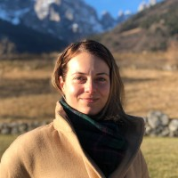
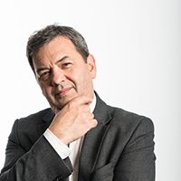
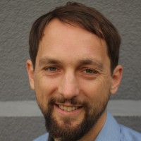
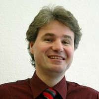

<link rel="stylesheet" href="https://www.w3schools.com/w3css/4/w3.css">

# Abstract

Automated Vehicles (AV) are maturing rapidly but safety is still an open problem and we must address the challenge of AV safety together as an industry. With recent traffic incidents involving AVs under test, we believe that is important to address the safety challenges inherent in the technology and help the innovation to move forward. This workshop invites researchers, industry professionals, government officials to discuss, challenge and develop a holistic AV Safety methodology and related practices. We will host presentations around the state-of-the-art work contributing to verification, validation, testing and transparency of AV safety. Such presentations will be complemented with industry and government insights into the challenges and applicability methods to AV safety. 

## Venue

This workshop will take place on Sunday, September 19th co-located with the [IEEE International Conference on Intelligent Transportation Systems, ITSC 2021](https://2021.ieee-itsc.org/).
The workshop will take place as a virtual event. 

See [ITSC registration](https://2021.ieee-itsc.org/registration/) to attend.

## Invited Speakers

Click on images for talk details

 <!-- Invited Speakers row 1-->

    
    

    
<b>Mario Trapp</b>

    
Executive Director at Fraunhofer Institute for Cognitive Systems.

    

    
    

    
<b>Julia Nitsch</b>

    
System Developer at Ibeo Automotive Systems

    

    
    

    
<b>Francesca Favaro</b>

    
Best Practices Specialist at Waymo.

    

 <!-- Invited Speakers row 2-->

  

      
      

      
<b>Kevin Gay</b>

      
Director, Safety Standards Policy at Aurora

      

  

  

      
      

      
<b>Robin Bloomfield</b>

      
Professor of System and Software Dependability at University City of London

      

  

  

      
      

      
<b>Peter Popov</b>

      
Associate Dean School of Mathematics, Computer Science and Engineering at City, University of London

      

  

 <!-- Invited Speakers row 3-->

  

      
      

      
<b>Jan Becker</b>

      
CEO & Co-Founder at Apex.AI

      

  

  

      
      

      
<b>Anthony Corso</b>

      
Executive Director of the Stanford Center for AI Safety at Stanford University

      

  

  

      
      

        
<b>Ed Straub</b>

        
Vice President, Land-based systems at SAE ITC

      

  

 <!-- Invited Speakers row 4-->

  

      
      

        
<b>Michelle Chaka</b>

        
Division Director for Data and Analytics at Virginia Tech Transportation Institute

      

  

  

      
      

        
<b>Oemer Sahin Tas</b>

        
Robotics & Machine Learning Specialist | Head of Department at FZI

      

  

## Agenda

<table class="agenda">
  <tr>
    <th colspan="4">TIME</td>
    <th>Speaker</td>
    <th>Talk </td>
  </tr>
  <tr>
    <td >PDT (GTM-7)</td>
    <td >EDT (GTM-4) <b> (Local Conference Time)</b></td>
    <td >UK (GTM+1)</td>
    <td >Central Europe (GTM+2)</td>
    <td ></td>
    <td ></td>
  </tr>
  <tr>
    <td >6:00</td>
    <td >9:00</td>
    <td >14:00</td>
    <td >15:00</td>
    <td colspan=2>Workshop Introduction</td>
  </tr>
  <tr>
    <td >6:10</td>
    <td >9:10</td>
    <td >14:10</td>
    <td >15:10</td>
    <td >Mario Trapp - Fraunhofer Institute</td>
    <td >"Towards managing Perception Uncertainty for Automated Driving"</td>
  </tr>
  <tr>
    <td >6:30</td>
    <td >9:30</td>
    <td >14:30</td>
    <td >15:30</td>
    <td >Michelle Chaka - VTTI</td>
    <td >"TBC"</td>
  </tr>
  <tr>
    <td >6:50</td>
    <td >9:50</td>
    <td >14:50</td>
    <td >15:50</td>
    <td >Sahin Tas - KIT</td>
    <td >"Safe and Convenient Decision Making at Occluded Intersections"</td>
  </tr>
  <tr>
    <td >7:10</td>
    <td >10:10</td>
    <td >15:10</td>
    <td >16:10</td>
    <td >Robin Bloomfield - City University of London</td>
    <td >"A new approach to Developing Safety-case templates for Autonomous Systems with Machine Learning"</td>
  </tr>
  <tr>
    <td >7:30</td>
    <td >10:30</td>
    <td >15:30</td>
    <td >16:30</td>
    <td >Peter Popov - City University of London</td>
    <td >"Probabilistic Models in AV safety assesment"</td>
  </tr>
  <tr>
    <td >7:50</td>
    <td >10:50</td>
    <td >15:50</td>
    <td >16:50</td>
    <td >Francesca Favaris - Waymo</td>
    <td >"Waymo Readiness Evaluation for Fully Autonomous Ride-Hailing"</td>
  </tr>
  <tr>
    <td >8:10</td>
    <td >11:10</td>
    <td >16:10</td>
    <td >17:10</td>
    <td colspan="2">Breakfast / Lunch / Dinner Break </td>
  </tr>
    <tr>
    <td >9:00</td>
    <td >12:00</td>
    <td >17:00</td>
    <td >18:00</td>
    <td >Anthony Corso - Stanford University</td>
    <td >"AI Safety Validation"</td>
  </tr>
    <tr>
    <td >9:20</td>
    <td >12:20</td>
    <td >17:20</td>
    <td >18:20</td>
    <td >Jan Becker - Apex.AI</td>
    <td >"Apex.OS ASIL D Certification"</td>
  </tr>
    <tr>
    <td >9:40</td>
    <td >12:40</td>
    <td >17:40</td>
    <td >18:40</td>
    <td >Kevin Gay - Aurora</td>
    <td >"Principles and Applications of Aurora's Safety Case Framework"</td>
  </tr>
    <tr>
    <td >10:00</td>
    <td >13:00</td>
    <td >18:00</td>
    <td >19:00</td>
    <td >Ed Straub - SAE</td>
    <td >"Motor Vehicle Standards and SAE Research Initiatives Overview"</td>
  </tr>
    <tr>
    <td >10:20</td>
    <td >13:20</td>
    <td >18:20</td>
    <td >19:20</td>
    <td >Julia Nitsch - Ibeo</td>
    <td >"Robust Automotive Perception in Urban Environments"</td>
  </tr>
  <tr>
    <td >10:40</td>
    <td >13:40</td>
    <td >18:40</td>
    <td >19:40</td>
    <td >Daniel Asljung - Zenseact</td>
    <td >"On Automated Vehicle Collision Risk Estimation using Threat Metrics in Subset Simulation"</td>
  </tr>
  <tr>
    <td >11:00</td>
    <td >14:00</td>
    <td >19:00</td>
    <td >20:00</td>
    <td colspan=2>Panel Discussion</td>
  </tr>
  <tr>
    <td >11:20</td>
    <td >14:20</td>
    <td >19:20</td>
    <td >20:20</td>
    <td colspan=2>End of Session</td>
  </tr>
</table>

<!-- Organizing Container -->

  <h2>Organizing Committee</h2>
  
Click for contact

  
 
    

    
      <h4>Ignacio Alvarez</h3>
      
Intel

    

    

      
      <h4>Maria Elli</h3>
      
Intel

    

    

      
      <h4>Fabian Oboril</h3>
      
Intel

    

  

  
 
    

      
      <h4>Cornelius Buerkle</h3>
      
Intel

    

    

      
      <h4>Bernd Gassmann</h3>
      
Intel

    

    

      
      <h4>Maximilian Naumann</h3>
      
Bosch

    

  

  
 
    

      
      <h4>Florian Wirth</h3>
      
KIT

    

    

      
      <h4>Jack Weast</h3>
      
Intel

    

    

      
      <h4>Christoph Stiller</h3>
      
KIT

    

  

